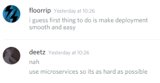

# fbgz.icu

## What is it?
One of my projects that literally does nothing. [Check it out](http://fbgz.icu). If you find something is missing, please make a feature request by creating an issue [here](https://github.com/jamesnicolas/fbgz.icu/issues). I plan to implement new features as fast as possible.

## What sort of features can I request?
You can request anything. Popular requests are the most likely to be implemented. I also might prioritize requests that don't cost that much.

An early request by my friend was to change the infrastructure to use microservices.

And it became so. fbgz.icu is currently just a free tier on AWS ECS, developed with Docker, and deployed with ECR.

## What does the name mean?
The name was also a request by a friend, it does have a deeper meaning, but not that deep.

## How do I request something?
You can post an issue right on this repo's [issues page.](https://github.com/jamesnicolas/fbgz.icu/issues)

